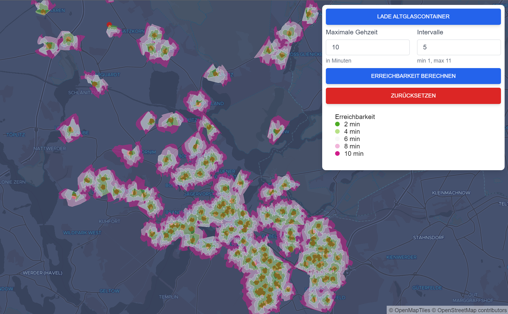

# Simple Isochrone Analysis

Calculate the reachability of [glass containers](https://opendata.potsdam.de/explore/dataset/standplatze-glassammlung/information/) in Potsdam/Germany using [Graphhopper](https://github.com/graphhopper/graphhopper).



## How to run

### Download and install

```shell
docker-compose -f docker-compose_download.yml up planetiler styles yarn_install
```

This will do a couple of things:

- Download an OpenStreetMap extract of Brandenburg using [Planetiler](https://github.com/onthegomap/planetiler)
- Use Planetiler to create vector tiles from said OSM extract
- Download vector tile styles and their required fonts
- Install node modules

### Run the app

```shell
docker-compose up
```

This will start the necessary services for the app:

- The routing engine to calculate isochrones (**Note**: Running this service for the first time will also create the routing graph from the OSM extract)
- Spin up a [tileserver](https://github.com/maptiler/tileserver-gl) for rendering vector tiles
- Start a web server with endpoints to the services above
- Start the node application

Once every service is running, open [http://localhost:9000](http://localhost:9000) to view the app.
